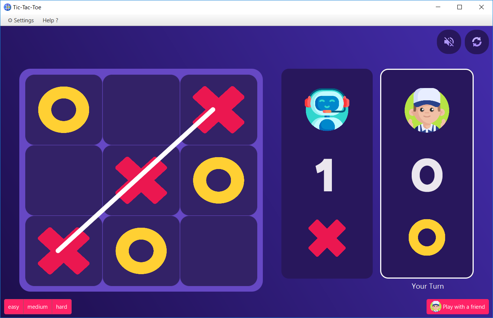

# Tic Tac Toe

This software was developped as an assignment during the 2019/20 university year at the CERI, Avignon University (France), by the following students:
* Yanis Labrak
* Valentin Vougeot

## Organization
The source code is organized around the MVC pattern.

* At the root of the project we have :
     * Models
        * Contain all the class for the objects
     * Vues
        * Contain all the FXML files which each corresponding to a "Vue"
     * Controllers
        * Contain all the methods which will handle the events for a specific view
     * Resources
        * Contain all the resources like the pictures and CSS style-sheets
     * Services
        * Contain all others useful classes
     * Config
        * Contain all configuration classes like the colors or the strings
     * The main class of the project
        * Main.java

## Installation
Here is the procedure to install this software :
1. Download the executable in the release section
2. Setup the build path
    1. Source > Add Folder > Choose the src folder
    2. Libraries
       * Add External Jar > Select [controlsfx-8.40.15.jar](https://mvnrepository.com/artifact/org.controlsfx/controlsfx/8.40.15)
       * Add External Jar > Select then TensorFlow JDK [libtensorflow-1.14.0.jar](https://www.tensorflow.org/install/lang_java)
       * Add Library > JavaFX SDK
       * Add Library > JRE System Library

## Development environment
* JavaFX
    * Install JavaFX: [Tutorial](https://o7planning.org/fr/10619/installation-de-e-fx-clipse-sur-eclipse)
    * Install SceneBuilder: [Tutorial](https://o7planning.org/fr/10621/installez-javafx-scene-builder-dans-eclipse)
    
## References
* [TensorFlow 2.0 Crash Course](https://youtu.be/6g4O5UOH304) : He explain the basics of TensorFlow 2.0.
* [Tic Tac Toe by Shashank Kumar](https://dribbble.com/shots/6187597-Tic-Tac-Toe/attachments) : Inspiration for the design
* [Using JavaFX Properties and Binding](https://docs.oracle.com/javafx/2/binding/jfxpub-binding.htm) : Java documentation for observers
